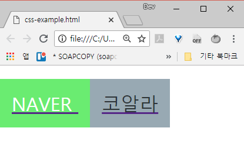

# Challenge 1

두 개의 링크 버튼을 만들어 봅시다.

왼쪽은 [https://naver.com](https://naver.com) 으로 연결되고  
오른쪽은 [http://coalastudy.com](http://coalastudy.com) 으로 연결됩니다.

각 버튼 요소는 span태그를 사용해 만들어주세요.  
그리고 텍스트 뿐만 아니라 버튼의 어느 부분을 눌러도 이동되어야 합니다!

