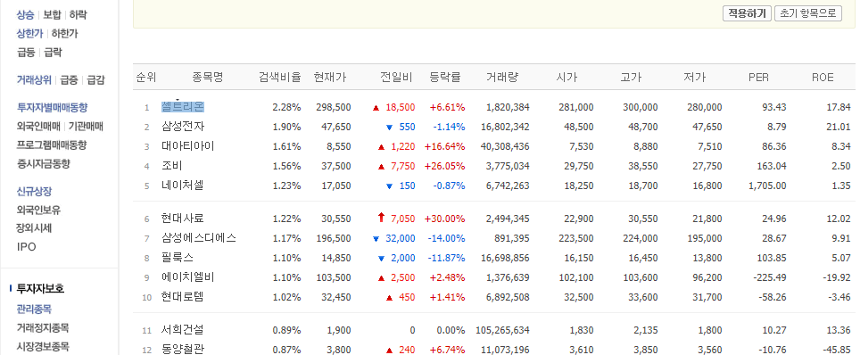

# Challenge 2

경로 찾기 컨테스트!

주어진 사이트에서 정해진 내용을 가리키는 경로를 찾아보세요.  
정답은 다음 페이지에 있습니다.

## 1. 난이도 下

여러분은 스타트업 개발자 뉴스레터의 신입 기자입니다. 해외 업계 동향을 파악하기 위해[https://news.ycombinator.com](https://news.ycombinator.com/)[/](https://news.ycombinator.com/) 에서 위 사진에 파랗게 표시된 기사 제목의 경로를 찾아보세요.

## 2. 난이도 中

여러분은 카카오 입사를 준비하는 취업준비생입니다. 카카오 개발팀에서 많이 쓰는 기술을 알아보기 위해 [http://tech.kakao.com](http://tech.kakao.com/)[/](http://tech.kakao.com/) 에서 위 사진에 파랗게 표시된 태그들의 경로를 찾아보세요.

## 3. 난이도 上

여러분은 빅데이터를 이용해 주식 투자를 해보려는 투자자입니다. 대세 종목의 동향을 파악하기 위해 [http://](http://finance.naver.com/sise/lastsearch2.nhn)[finance.naver.com/sise/lastsearch2.nhn](http://finance.naver.com/sise/lastsearch2.nhn) 에서 위 사진에 파랗게 표시된 종목명들의 경로를 찾아보세요.

