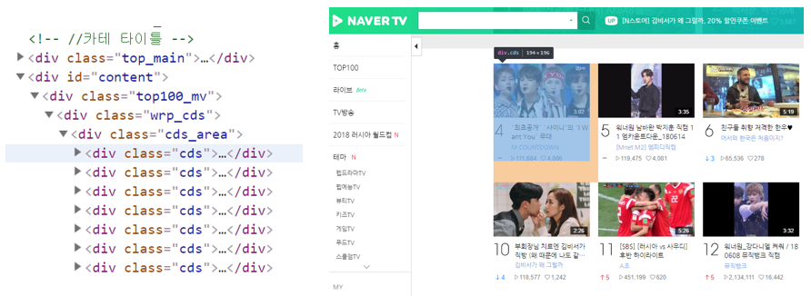

# Stage 3 - CSS 선택자에 대해 알아보자

## CSS 선택자의 필요성


Stage 2에 등장한 블로그 글을 여러 개 만든다고 생각해 봅시다.

코드는 어떻게 될까요?

```markup
<div>
    <h3 style="margin: 5px;">김코알라</h3>
    <span style="color: #aaa; font-size: 13px;">2018년 6월 15일 10:30 오전.</span>
    <h3 style="color: #3a6;">데이터 수집 스터디에 오신 것을 환영합니다.</h3>
    <span>오늘은 기초 개념과 HTML/CSS에 대해 알아보겠습니다.</span>
</div>

<div>
    <h3 style="margin: 5px;">김코끼리</h3>
    <span style="color: #aaa; font-size: 13px;">2018년 6월 16일 03:14 오후.</span>
    <h3 style="color: #3a6;">서비스명 후보중에 코끼리도 있었는데...</h3>
    <span>제가 코알라보다 못한게 뭐죠?</span>
</div>
```

그대로 복사하여 내용만 바꾸었습니다.  
똑같은 디자인으로 리스트를 만들다보니 스타일 코드의 중복이 일어납니다.

작성이 비효율적이고, 제목을 파란색으로 수정하고 싶어지면 두 군데를 바꿔야 합니다. 글이 100개라면 100군데를 바꿔야 하구요.

```markup
<style>
    #container {
        background-color: #cecece;
        width: 100%;
        height: 100%;
    }

    .post {
        background-color: white; padding: 10px; margin: 10px; width: 400px;
    }

    .name {
        margin: 5px;
    }

    .date {
        color: #aaa;
        font-size: 13px;
    }

    .title {
        color: #3a6;
    }
</style>
```

이럴 때에는 HTML 문서 끝에 style이라는 태그를 만들어 CSS 스타일들을 몰아넣는 것이 좋습니다. 함께 적용할 스타일들을 묶어서 container, post 등의 이름을 붙여놓고 필요한 HTML 태그에서 호출하면 통채로 적용된답니다.

## ID와 CLASS

### ID

```markup
#container {
    background-color: #cecece;
    width: 100%;
    height: 100%;
}
```

```text
<div id="container">...</div>
```

ID는 한 HTML 태그에 붙이는 고유한 식별자입니다. 같은 HTML 문서 내에 수백 수천 개의 div가 존재할 수 있지만, container라는 ID는 하나만 가질 수 있죠.  
여러 개의 목록을 둘러싸는 배경 div 처럼, 페이지에 딱 하나만 존재하는 요소를 정의할 때 사용합니다.

CSS 스타일 태그 안에서는 \#id명 { 스타일 목록... } 으로 선언하고  
HTML 태그에 적용할 때에는 id="id명" 속성을 추가해줍니다.

### CLASS

```text
.post {
    background-color: white; padding: 10px; margin: 10px; width: 400px;
}
```

```text
<div class="post">...</div>
```

Class는 여러 HTML 태그에 동시에 적용하고 싶은 스타일을 정의할 때 사용합니다. 트위터의 트윗들, 쇼핑몰의 상품들, 뉴스 서비스의 기사들처럼 서비스의 같은 데이터들이 서로 비슷한 디자인이어야 사용하기 편한 서비스겠죠?

CSS 스타일 태그 안에서는 .class명 { 스타일 목록... } 으로 선언하고  
HTML 태그에 적용할 때에는 class="class명" 속성을 추가해줍니다.

```text
<div>
    <h3 style="margin: 5px;">김코끼리</h3>
    <span style="color: #aaa; font-size: 13px;">2018년 6월 16일 03:14 오후.</span>
    <h3 style="color: #3a6;">서비스명 후보중에 코끼리도 있었는데...</h3>
    <span>제가 코알라보다 못한게 뭐죠?</span>
</div>
```

```text
<div class="post">
    <h3 class="name">김코끼리</h3>
    <span class="date">2018년 6월 16일 03:14 오후.</span>
    <h3 class="title">서비스명 후보중에 코끼리도 있었는데...</h3>
    <span>제가 코알라보다 못한게 뭐죠?</span>
</div>
```

CSS를 HTML 태그 내에 직접 적용했을 때와 따로 빼냈을 때의 HTML 코드 비교입니다.

태그의 의미와 내용이 본질이고 스타일은 껍데기라고 한다면, 위의 코드는 둘이 혼재되어 명확히 구분하기가 쉽지 않고, 아래의 코드는 명확히 구분되어 가독성이 높습니다.

앞서 말씀드렸듯이 여러 태그에 똑같이 적용되어있는 스타일을 변경하고 싶을 때에도 한 군데만 변경하면 되기 때문에 비교할 수 없이 효율적입니다.

따로 빼냈을 때는 style 태그가 생략된 예시이기 때문에 여기서 코드의 양을 비교하기는 힘들지만, 일반적으로 중복 스타일이 없어지기 때문에 코드의 양도 훨씬 줄어듭니다.

## 데이터 수집에서 꼭 필요한 이유

이와 같이 CSS 선택자, 특히 클래스는 개발자들이 개발할 때 훨씬 생산성을 높여주기 때문에 사용하지 않을 수 없습니다. 데이터 수집 시에는 이를 이용하여 원하는 데이터의 위치를 수집 프로그램에게 알려줍니다.



2주차에 수집해 볼 네이버 TV TOP100 입니다.  
프로그램의 짧은 클립 여러 개로 순위를 매기다보니, 인기있는 프로그램은 여러 개의 클립이 순위에 올라오게 됩니다. 같은 프로그램의 클립을 함께 모아 프로그램별 순위를 내고 싶습니다.

이를 위해 HTML 문서에서 TOP 100에 있는 각 프로그램의 정보를 가져와야 하는데요.  
왼쪽의 코드에 보이는 여러 개의 div.cds가 각 프로그램 정보를 나타내도록 설계되있는 것을 볼 수 있습니다.

네이버의 개발자들이 프로그램 정보를 일정하게 보여주기 위해 cds 클래스를 사용하였으니, 수집할 때는 cds 클래스를 가진 div만 수집하면 되는 것이죠.  
그 자세한 방법은 Stage 4에서 알아보도록 하겠습니다.

## 선택자의 사용

데이터 수집 시에는 태그명, ID명, 클래스명 및 기타 다양한 선택자를 활용하여 목표하는 데이터 구조에 정확히 접근하는 것이 가장 중요합니다.

하지만 태그명이나 클래스명은 어느 곳에나 사용될 수 있기 때문에 그 정확성이 보장되지 않죠.

```text
class not correct example code
```

class not correct example image

위에서 는 의 ~이고 -는 -의 -입니다. 하지만 같은 클래스를 가지고 있습니다.

-를 수집하는 것을 목표로 모든 -를 가져온다면 -까지 수집되어 잘못된 결과를 만들어낼 것입니다.

그래서 좀 더 정확한 위치를 알려주어야 합니다.

이 때 사용할 수 있는 것이 자식 선택자입니다.

```text
child selector example
```

이렇게 표기하면 - 의 자식 요소 중에서만 -를 선택하라는 명령이 되어 -는 제외됩니다.

```text
id identifiable example code
```

id identifiable example image

이런 경우는 어떨까요?

-만을 정확하게 선택하기 위해서 --의 선택자를 사용하여야 합니다.

이 때 id의 위력이 나옵니다. 문서 전체를 뒤져보지 않아도 -는 하나밖에 없기 때문에, -를 생략한 선택자를 사용해도 반드시 -만 정확히 선택할 수 있습니다.

반면 id대신 클래스만 사용했다면 수천 줄에 이르는 코드 중 다른 곳에도 쓰였을 지 모르니 섣불리 생략하기가 어렵겠죠.

클래스는 여러 군데 사용이 가능한데 ID를 사용할 필요가 없는 거 아냐? 라는 훌륭한 의문을 가지셨던 분들은 여기서 그 의문이 해소되었길 바래요!

