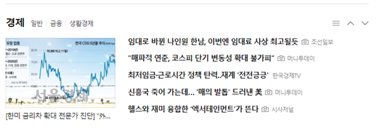
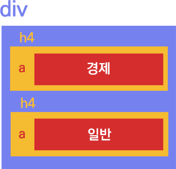
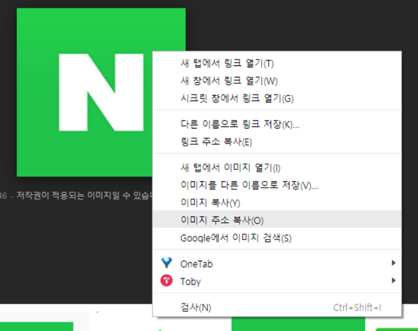

# Stage 1 - HTML에 대해 알아보자

첫번째 스테이지에서는 먼저 웹페이지의 기본이 되는 HTML에 대해 배워봅니다.

우리가 수집하려는 데이터는 웹페이지에 존재하기 때문에, 데이터 수집을 배우기 위해선 먼저 웹페이지의 구조에 대해 이해해야 하기 때문입니다.

## HTML이 뭔가요?

웹페이지를 이루고 있는 구성요소들을 작성한 문서입니다.

요즘엔 워드프레스나 Wix와 같은 도구를 사용하면 원하는 텍스트, 버튼, 이미지같은 것들을 쉽게 가져다 웹페이지를 구성할 수 있습니다.

하지만 이렇게 만들어진 웹페이지는 결국 컴퓨터가 읽을 수 있는 코드로 변환되어야 합니다. 흔히 말하듯 0과 1밖에 모르는 컴퓨터에겐, 코드로 말해주는 것이 훨씬 효율적이기 때문이죠.

결국 글 한 단락, 버튼 하나, 이미지 하나하나가 각각 구성요소의 단위가 됩니다.

```markup
<div>
    <div>
        <h4><a href="#">경제</a></h4>
        <span>
            <a href="#">일반</a>
            <a href="#">금융</a>
            <a href="#">생활경제</a>
        </span>
    </div>
    <div>
        <dl>                
            <a>
                 <br/>


            <a href="#">[한미 금리차 확대 전문가 진단] "外人 자금 이탈땐 증시 출렁"..."조정, 저가매수 기회로"</a>

        </dl>
        <div>
            <ul>
                <li>
                    <a href="#"><strong>임대로 바뀐 나인원 한남, 이번엔 임대료 사상 최고될듯</strong></a>
                    <i>포토</i> <span>조선일보</span>
                </li>
                <li>
                    <a href="#"><strong>"매파적 연준, 코스피 단기 변동성 확대 불가피"</strong></a>
                    <i>포토</i> <span>머니투데이</span>
                </li>
...이하 생략
```

아직 코드를 자세히 들여다 볼 필요는 없습니다. 이러한 HTML 코드를 브라우저가 읽고 해석합니다.




그리고 해석의 결과가 브라우저에서 인간이 보는 방식으로 표현됩니다.

## HTML의 작성 방식

먼저 위에서 말씀드린 HTML의 각 단위 요소는 "태그"라고 부릅니다.  
태그는 각각의 고유한 역할을 가집니다.  
하나의 태그를 먼저 보겠습니다.

```markup
<a>경제</a>
```

* 하나의 태그는 &lt;&gt;안에 들어있습니다.
* &lt;태그명&gt; \(여는 태그\) 와 &lt;/태그명&gt; \(닫는 태그\) 가 한 쌍을 이룹니다.
* 여는 태그와 닫는 태그 사이는 그 태그의 내용입니다.

위 코드는 a라는 태그가 사용되었습니다.  여는 태그와 닫는 태그 사이에 "경제"라는 글자가 내용으로 들어있습니다.


  
다음으로 여러 개의 태그가 구조를 이루는 예시를 보겠습니다.

```markup
<div>
    <h4><a>경제</a></h4>
    <h4>
        <a>일반</a>
    </h4>
</div>
```

* 태그의 내용으로 다른 태그가 들어갈 수도 있습니다.
* 들여쓰기를 통해 내부 단계를 구분합니다. \(안에 있는 태그일수록 더 들여씁니다.\)
* 내용이 많지 않을 땐 한줄로 늘여 쓰기도 합니다.

그래서 위에 보이는 2행과 3~5행의 코드는 같은 역할을 합니다.  
한줄로 쓰건, 태그마다 행을 나눠서 쓰건 사람의 눈에 편해보이기 위해 바꾸는 것이지, 실제로 웹페이지에 그려질 때는 완전히 똑같습니다.  
내용만 경제 / 일반으로 서로 다르지요.




가상의 구역으로 서로의 구조를 그려보면 위와 같을 것입니다.

2행과 3~5행 모두 h4 태그의 내용으로 a 태그를 가지고 있고, 그 a태그는 텍스트를 가지고 있습니다.   
또한 두 h4 태그는 가장 바깥의 div라는 태그의 내용입니다. 

## 기초적으로 알아야 할 태그 소개

### a 태그


a태그는 위와 같이 클릭하면 다른 웹페이지로 넘어갈 수 있는 링크 역할을 합니다. 기본적으로 마우스를 올리면 손가락 모양으로 변하도록 지정되어 있습니다.


```markup
<a href="http://news.naver....">신이 내린 선물 골든 부트, 누가 거머쥘까</a>
<a href="http://news.naver....">"2018월드컵 어느 국가가 우승?"···'점쟁이'동물···</a>
<a href="http://news.naver....">울버햄튼·맨유·유벤투스, 인테르 풀백 칸셀로 영입전</a>
<a href="http://news.naver....">러시아월드컵, 오늘밤 자정 '화려한 개막'</a>
<a href="http://news.naver....">양국 몸값 합해 1조9000억···'황금발'들의 결투</a>
```

a 태그의 코드는 이렇습니다.

태그 안에 이상한 친구가 들어왔는데요? href="..." 이건 뭐죠?  
a 태그는 어디론가 이동하기 위해 존재하기 때문에, 꼭 이동할 웹페이지의 위치도 알려주어야 합니다.

그래서 href, 즉 hypertext reference라는 뜻의 "속성"을 추가하여 그 내용으로 주소를 입력해주는 것입니다.


이렇게 여는 태그의 꺽쇠 안에 같이 들어갈 수 있는 것들을 속성이라고 합니다.  
태그 이름만으로는 부족한 정보를 보충해주기 위해 존재하는데요.  
속성 이름 = "속성 값" 의 형태로 태그 내부에 들어가게 됩니다. 필요에 따라 여러 개의 속성이 작성될 수도 있습니다.  
  
여기에서는 href가 "속성 이름"이고 쌍따옴표 \(“”\) 안에 있는 뉴스 주소가  "속성 값"이 되겠죠?

속성은 태그마다 부여할 수 있는 것이 정해져있고, a 태그에는 항상 href 속성이 부여됩니다.  
이 href는 데이터 수집의 주요 대상이기도 하니 잘 기억해주세요!


### img 태그


img 태그는 그림, 사진의 경로를 받아 실제로 보여줍니다.

```markup

```

img라는 태그명은 “그림을 표시할 것이다” 라는 뜻밖에 안되기 때문에 실제 그림이 있는 주소를 src라는 속성으로 넣어줘야 합니다. 다음으로 width와 height 속성으로 표시될 이미지의 크기를 정해주고 있네요.

여기서 잠깐, 지금 보고 있는 태그가 앞에 나왔던 태그와 다른 점을 느끼신 분?

정답은 바로! 닫는 태그가 없다는 것입니다.   
img태그에 src속성으로 이미지 주소를 넣어주면 더이상 들어갈 내용이 없기 때문에 닫는 태그 없이 단일 태그로 작성해도 괜찮습니다.


### div 태그

```markup
<div>
    
    <a href="https://...">축구선수</a>
</div>
```

div태그는 위의 두 태그와 달리 기본적으로 눈에 보이지 않습니다.  
위와 같은 코드는 실제로 이렇게 표시됩니다.


div 태그는 서로 연관된 태그들을 같은 구역으로 분류하기 위해 사용됩니다.

위 그림에서 점선으로 나타낸 부분이 div의 영역이며, 실제로 점선이 보이지는 않습니다.

웹페이지를 만들 때 구역을 나눌 일이 정말 많기 때문에 div태그를 가장 많이 보게 되실 겁니다.


## 실습 - HTML 문서 작성해보기

데이터 수집을 잘 하기 위해서 HTML 문서를 잘 작성할 필요는 없어요.  
작성할 때는 수많은 태그의 특징과 각 태그에서 자주 사용되는 속성도 알아야 하고, 배치를 어떻게 할지도 고심해봐야 하지만 수집할 땐 상하 구조만 잘 파악하고 내용을 찾아가면 되니까요.  
그래도 HTML 태그에 관한 정말 기초적인 이해를 다지기 위해 함께 작성해보도록 하겠습니다.


HTML의 작성에는 jsfiddle이라는 서비스를 사용하면 좋습니다.

별다른 설치 없이도 코드를 쉽게 작성하고 결과를 확인할 수 있기 때문입니다.

먼저 [https://jsfiddle.net/](https://jsfiddle.net/) 로 접속해주세요.

좌측 상단의 HTML 영역 안에 내용을 작성합니다. 


먼저 내용을 감싸는 div 태그 안에 img 태그와 a 태그를 작성해주세요. 

태그를 작성할 때는 &lt;&gt; 등을 쓰는 것이 귀찮습니다. 따라서 자동완성을 적극적으로 사용하여야 합니다.

편집기 안에서 div만 타이핑하고 키보드의 Tab을 눌러보세요. &lt;div&gt;&lt;/div&gt;까지 자동으로 완성됩니다.

필수 속성을 가진 img나 a 태그는 src 속성, href 속성까지 자동으로 입력해줍니다.




img태그에 들어갈 그림의 주소를 얻기 위해 인터넷에서 원하는 그림을 찾아서 우클릭하고 이미지 주소 복사를 해주세요. 이미지 복사가 아닙니다!


복사한 주소를 src 속성 안에 붙여넣어 주세요.


a태그의 href 속성 안에도 이동할 주소를 입력하고, 여는 태그와 닫는 태그 사이에 링크를 표현할 텍스트도 작성해줍니다. 


작성이 끝나면 왼쪽 위의 Run 버튼을 눌러주세요.


작성한 HTML 코드가 오른쪽 아래의 결과창에 실제 웹페이지로 표시됩니다.  
\(보안 문제로 인해 직접 링크가 연결되지는 않습니다. 우클릭으로 새 창에서 열어주세요.\)

