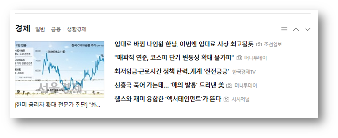
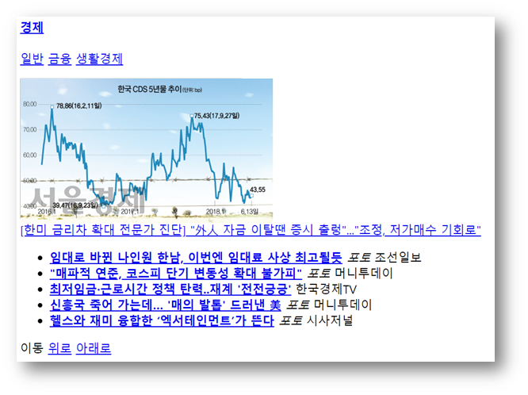
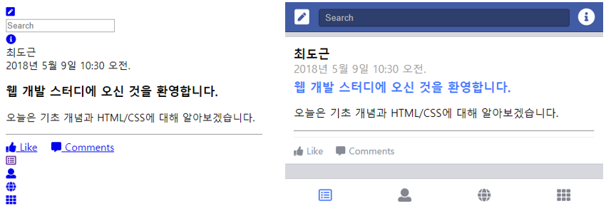
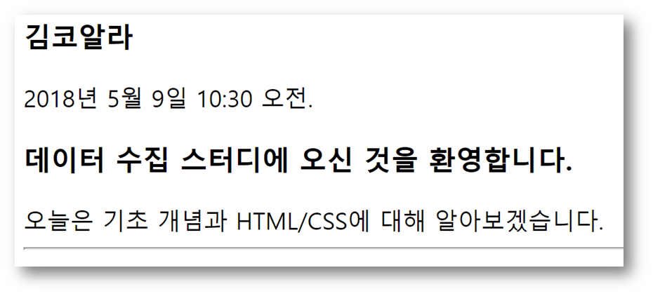
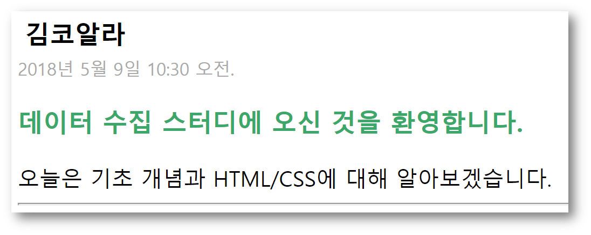
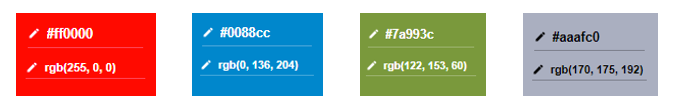
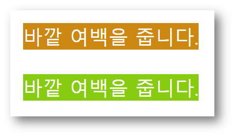
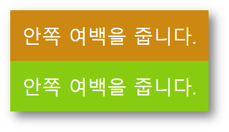

# Stage 2 - CSS에 대해 알아보자

두번째 스테이지에서는 먼저 웹페이지의 또다른 중요 요소인 CSS에 대해 배워봅니다.

CSS의 본래 용도인 장식 효과는 데이터 수집과 관련이 없지만, 그 과정에서 발생하는 CSS의 특징들은 데이터 수집에 아주 중요합니다.

이를 이해하기 위해 먼저 기초적인 CSS의 개념에 대해 알려드리겠습니다.


## CSS가 뭔가요?

이전 스테이지에서 HTML에 대해 설명드리면서 코드와 그 결과를 보여드렸습니다.



하지만 이 결과는 사실 HTML만으로 구성된 것이 아닙니다.




실제로 CSS를 제외하고 HTML만으로 코드를 실행시켜보면 이렇게 못생긴 페이지가 나온답니다.


  
둘 다 흰 바탕에 텍스트 위주라 큰 체감이 느껴지지 않으신다면 아래 예시를 보세요.




웹 개발 스터디에서 잠시 빌려왔습니다.  
왼쪽이 HTML만으로 구성한 페이지이고 오른쪽이 CSS를 추가한 페이지입니다.

여러분이 새로 SNS을 시작한다면 어떤 서비스를 하시겠어요?

사람을 대상으로 만드는 웹페이지이기 때문에 보기 좋아야 하는 것은 물론이고, 이용 편의성과도 연결되기 때문에 CSS는 HTML만큼 매우 중요한 부분입니다.


## CSS의 작성 방식

CSS의 작성 방식에는 여러가지가 있지만, 처음엔 HTML 태그에 직접 집어넣는 것이 쉽습니다.

스테이지 1에서 소개해드린 jsfiddle에서 직접 해보셔도 좋습니다.


```markup
<div>
    <h3>코알라</h3>
    <span>2018년 5월 9일 10:30 오전.</span>
    <h3>데이터 수집 스터디에 오신 것을 환영합니다.</h3>
    <span>오늘은 기초 개념과 HTML/CSS에 대해 알아보겠습니다.</span>
</div>
```

이렇게 HTML만으로 작성한 코드는 아래와 같이 표시됩니다.




이러한 HTML only 코드에서

```markup
<div>
    <h3 style="margin: 5px;">코알라</h3>
    <span style="color: #aaa; font-size: 13px;">2018년 5월 9일 10:30 오전.</span>
    <h3 style="color: #3a6;">데이터 수집 스터디에 오신 것을 환영합니다.</h3>
    <span>오늘은 기초 개념과 HTML/CSS에 대해 알아보겠습니다.</span>
</div>
```

태그 안에 style이라는 속성을 추가하고 속성 값으로 여러가지 추가 정보를 입력할 수 있습니다.  
이 코드의 결과는 아래와 같습니다.



CSS를 추가한 모습입니다.

src, href 와 같이 태그 내에 style이라는 속성을 추가하여 CSS를 삽입하는 방법입니다.  
삽입되는 스타일의 형식은 스타일명: 값; 입니다.   
그리고 여러 스타일을 동시에 적용할 때는 꼭 ;로 구분해줘야 합니다.


## 몇 가지 CSS 스타일 배워보기

이해를 위해 쉽게 적용해 볼 수 있는 몇 가지 스타일을 배워보도록 하겠습니다.


### color 스타일

요소 안에 있는 글자의 색을 바꿉니다.

```markup
<span style="color: red;">
    파란색으로 바뀝니다.
</span>
```

이 코드의 결과는


color: red; 이기 때문에 파란색이 아니고 빨간색입니다.


### background-color 스타일

요소의 배경색을 바꿉니다.

```markup
<span style="background-color: #99aab5;">
    배경색이 바뀝니다.
</span>
```

이 코드의 결과로



색에 들어가는 값이 생소하시죠?

웹에서 색을 정하는 원리에 대해 알려드리겠습니다.

기본적으로 **빛의 삼원색**을 각각 0에서 255까지 지정할 수 있습니다.  
각 색깔은 2자리 16진수로 표현됩니다. 00은 색이 없다는 뜻이고, ff가 가장 강한 색입니다.

16진수는 0, 1, 2, 3, 4, 5, 6, 7, 8, 9 다음에 a, b, c, d, e, f 가 나오구요.  
앞자리가 뒷자리보다 변동폭이 더 크겠죠?  
0f보다 20이 크다는 뜻입니다. 10진수에서 09보다 20이 큰 것처럼요.

그리고 세가지 색을 빨강, 초록, 파랑의 순서로 합쳐서 \#빨빨초초파파 의 형태로 표현합니다.  
다음 예시를 봐주세요.



\#ff0000은 빨강이 ff로 최대값이고 초록, 파랑은 0입니다. 따라서 새빨간 색이 됩니다.

\#0088cc는 빨강이 0이고 초록은 중간정도, 파랑은 최대값에 가깝습니다. 약간 연한 파랑색이 되었네요.

나머지도 마찬가지로 생각해보세요!

그리고 red, blue, black 등의 기본적인 색상은 직접 입력해도 사용이 가능합니다.



### margin 스타일

구역 바깥에 여백을 줍니다.

```markup
<p style="background-color: #cc8811; color: #ffffff; margin: 10px;">
    바깥 여백을 줍니다.
</p>

<p style="background-color: #88cc11; color: #ffffff; margin: 10px;">
    바깥 여백을 줍니다.
</p>
```

margin을 10px \(픽셀\)로 준 결과



각 상자가 자신을 둘러싼 부모 요소나 다른 요소들과 간격을 벌리고 있습니다.


### padding 스타일

구역 안에 여백을 줍니다.

```markup
<p style="background-color: #cc8811; color: #ffffff; padding: 10px;">
    안쪽 여백을 줍니다.
</p>

<p style="background-color: #88cc11; color: #ffffff; padding: 10px;">
    안쪽 여백을 줍니다.
</p>
```

padding을 10px로 준 결과



각 상자는 외부 요소들과는 여백 없이 붙어있고, 내부의 텍스트와 간격을 벌리고 있습니다.


재미있으신가요? 더 많은 CSS 속성을 배워보고 싶다면  
[https://www.w3schools.com/css/default.asp](https://www.w3schools.com/css/default.asp) 에 들어가보시는 것을 추천합니다.

데이터 수집에는 본 스테이지의 내용 정도만 이해한다면 충분합니다.

그럼 첫번째 도전과제에서 뵙겠습니다!

