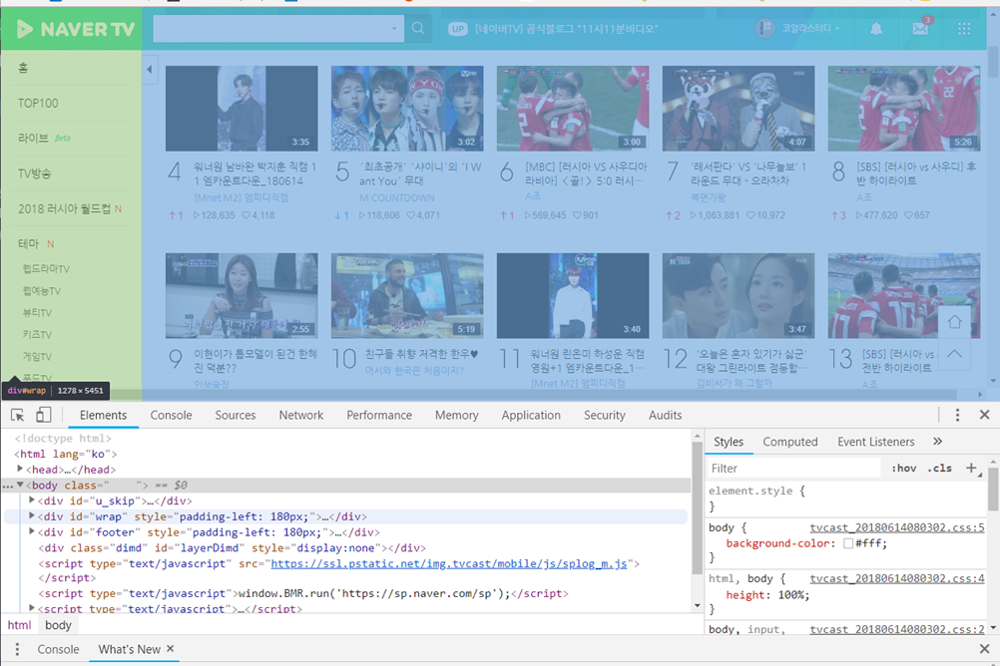
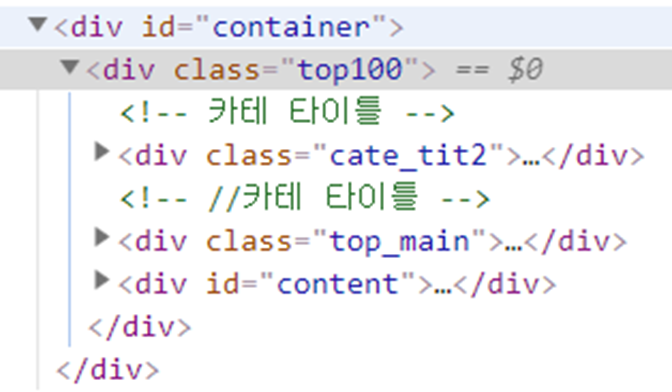
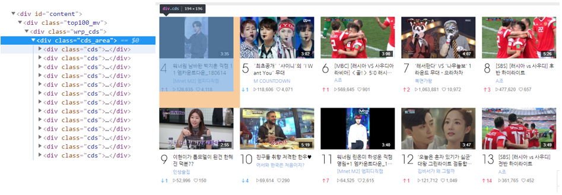

# Stage 3 - 개발자 도구로 페이지를 분석해보자

세 번째 스테이지에서는 얼마 되지 않지만 여태 배운 지식을 활용해서 데이터를 찾아 나섭니다.

크롬 브라우저의 강력한 개발자용 도구와 함께라면 크게 어렵지는 않을 것입니다.

## 목표 선정

3주차부터 본격적으로 데이터를 수집해 볼 텐데요. 네이버 TV TOP 100 페이지에서 각 클립의 제목, 채널명, 조회수, 좋아요 수를 수집하게 됩니다.

여러 리스트를 수집할 때는 리스트 항목 중 하나를 정해 선택자 경로를 만든 후, 이것을 일반화시켜 다른 모든 리스트를 수집할 수 있는지 검증하는 절차를 거칩니다.

따라서 먼저 4위 클립의 정보를 찾아가 보도록 하겠습니다.

## 1. 처음부터 따라 내려가는 방법

크롬 브라우저에서 네이버 TV TOP 100\([https://tv.naver.com/r\)에](https://tv.naver.com/r%29에) 접속하고 F12를 눌러 개발자 도구를 열어주세요.

탭을 Elements에 맞추면 현재 페이지의 HTML 문서가 보입니다.

여기에 마우스를 하나하나 대보면 구역이 파랗게 변하는 경우가 있을 겁니다.

바로 현재 마우스를 대고있는 태그가 커버하는 범위를 나타내는 것입니다.

div\#wrap에 마우스를 대 보았더니, 브라우저 창에 색이 입혀지는 것을 볼 수 있습니다.

이는 지금 대고 있는 요소의 범위를 나타냅니다. 녹색은 해당 HTML 요소가 가진 여백을 나타내고, 파란색 영역이 실제 요소의 내용입니다.

범위가 너무 넓으니 div\#wrap 좌측의 세모 버튼을 눌러 내부로 더 들어가 봅시다.

div\#wrap의 내부입니다.

script 태그는 HTML 요소가 아니므로 무시하셔도 좋으며, 나머지는 각각 div\#header, div\#aside, div\#container, div.floating\_top 입니다. 각 div에 다시 마우스를 대보면 div\#wrap의 구조를 더 잘 파악할 수 있습니다.

우리가 원하는 클립 리스트는 \#container 안에 있네요. 한 번 더 펼쳐봅시다.

div.top100이라는 자식 요소 안에 또 다시 div.cate\_tit2, div.top\_main, div\#content가 있네요.

최상위 3개 클립은 div.top\_main에, 나머지 97개는 div\#content에 들어있는 것을 확인할 수 있습니다.

추후 100개의 클립을 모두 수집하려면 둘을 나누어 처리해야겠습니다. 지금은 자료가 더 많은 div\#content로 들어가봅시다.

div.top100\_mv와 div.wrp\_cds를 거치면 그 안에 수많은 div.cds가 들어있고, 마우스를 대보면 이 div 하나하나가 각 클립을 포함하고 있다는 것을 알 수 있습니다.

이렇게 리스트의 각 요소까지 접근했다면 성공적으로 수집할 수 있다고 보시면 됩니다.

남은 것은 이 요소를 더 파고들어 원하는 정보만 뽑아내는 것입니다.

여태까지 따라 내려온 모든 선택자를 경로로 만들면 다음과 같습니다.

div\#wrap &gt; div\#container &gt; div.top100 &gt; div\#content &gt; div.top100\_mv &gt; div.wrp\_cds &gt; div.cds\_area &gt; div.cds

이렇게 위에서부터 찾아 내려오면 페이지의 전반적인 구조를 파악할 수 있게 되지만 찾는 속도는 다소 느립니다.

## 2. 끝에서 거슬러 올라가는 방법

이와 반대로 가장 작은 요소로부터 거슬러 올라가는 방법도 있습니다.

먼저 원하는 부분을 우클릭하여 "검사" 라는 버튼을 누릅니다. \(개발자 도구가 열려있는 상태여야 합니다!\)

그러면 개발자 도구에서 바로 우클릭한 부분까지 내려갑니다.

그런데 4위 클립 정보를 넘어서 너무 디테일한 제목 태그까지 도달하고 말았네요. 원하는 적절한 범위가 선택될 때까지 거슬러 올라갑니다.

찾아낸 요소 div.cds를 선택자로 사용합니다.

깜짝 실습!

[https://news.ycombinator.com](https://news.ycombinator.com) 에 접속하여 첫 번째 기사 제목의 선택자를 찾아 보세요.

정답은...

a.storylink 입니다.

