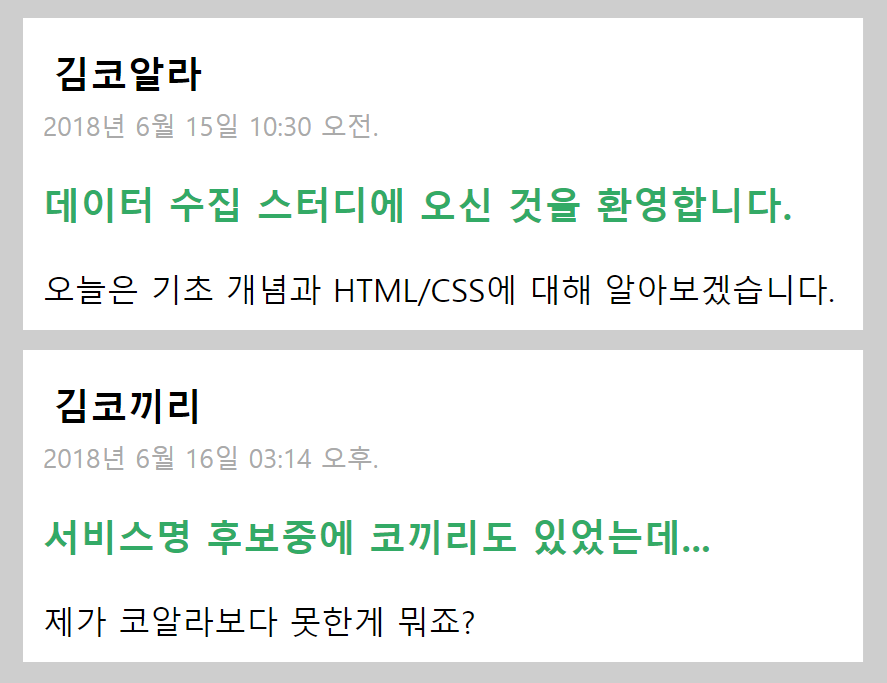
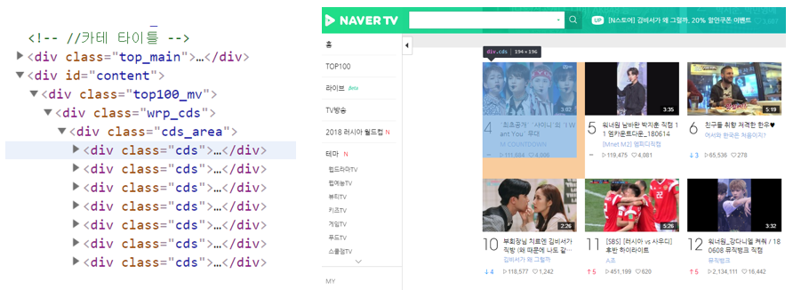

# Stage 3 - CSS 선택자에 대해 알아보자

세 번째 스테이지에서는 CSS 선택자에 대해 알려드립니다.

개발자들이 개발의 편의를 위해 자주 사용하는 CSS의 특징이 있는데, 이것이 데이터 수집에 아주 중요한 역할을 합니다.

## CSS 선택자의 필요성



Stage 2에 등장한 블로그 글을 여러 개 만든다고 생각해 봅시다.   
글이 한 개만 있는 블로그를 만들 수는 없으니까요.

그럼 코드는 어떻게 될까요?


```markup
<div>
    <h3 style="margin: 5px;">김코알라</h3>
    <span style="color: #aaa; font-size: 13px;">2018년 6월 15일 10:30 오전.</span>
    <h3 style="color: #3a6;">데이터 수집 스터디에 오신 것을 환영합니다.</h3>
    <span>오늘은 기초 개념과 HTML/CSS에 대해 알아보겠습니다.</span>
</div>

<div>
    <h3 style="margin: 5px;">김코끼리</h3>
    <span style="color: #aaa; font-size: 13px;">2018년 6월 16일 03:14 오후.</span>
    <h3 style="color: #3a6;">서비스명 후보중에 코끼리도 있었는데...</h3>
    <span>제가 코알라보다 못한게 뭐죠?</span>
</div>
```

이전 코드를 그대로 복사하여 내용만 바꾸었습니다.

그런데 맘에 안드는 부분이 있어요.  
똑같은 디자인으로 리스트를 만드려다보니 스타일 코드의 중복이 일어납니다.

작성이 비효율적이고, 제목을 파란색으로 수정하고 싶어지면 두 군데를 바꿔야 합니다. 글이 100개라면 100군데를 바꿔야 하구요.


이럴 때는 과감히 스타일 코드들을 분리시켜야 합니다.

```markup
<style>
    #container {
        background-color: #cecece;
        width: 100%;
        height: 100%;
    }

    .post {
        background-color: white; padding: 10px; margin: 10px; width: 400px;
    }

    .name {
        margin: 5px;
    }

    .date {
        color: #aaa;
        font-size: 13px;
    }

    .title {
        color: #3a6;
    }
</style>
```

함께 적용할 스타일들을 묶어서 container, post 등의 이름을 붙여놓고 필요한 HTML 태그에서 이름만 호출하면 통채로 적용된답니다.

jsfiddle에서 실제로 테스트해보고 싶으신가요?

위 스타일들을 그대로 HTML 영역의 끝 부분에 작성할 수도 있고,  
우측에 마련된 CSS 영역에 작성할 수도 있습니다. 다만 이때는 &lt;style&gt; &lt;/style&gt;을 삭제해야 합니다.


## ID와 CLASS

### ID

```css
#container {
    background-color: #cecece;
    width: 100%;
    height: 100%;
}
```

ID 스타일 정의 코드입니다. \#를 붙여 ID라는 것을 나타냅니다.


```markup
<div id="container">...</div>
```

ID 스타일 적용 코드입니다.


ID는 **한 HTML 태그에 붙이는 고유한 식별자**입니다. 같은 HTML 문서 내에 수백 수천 개의 div가 존재할 수 있지만, container라는 ID는 하나만 가질 수 있죠.  
여러 개의 목록을 둘러싸는 배경 div 처럼, 페이지에 딱 하나만 존재하는 요소를 정의할 때 사용합니다.

CSS 스타일 태그 안에서는 \#id명 { 스타일 목록... } 으로 선언하고  
HTML 태그에 적용할 때에는 id="id명" 속성을 추가해줍니다.


### CLASS

```css
.post {
    background-color: white; padding: 10px; margin: 10px; width: 400px;
}
```

클래스 스타일 정의 코드입니다. .\(점\)을 붙여 클래스라는 것을 나타냅니다.


```markup
<div class="post">...</div>
```

클래스 스타일 적용 코드입니다.


클래스는 여러 HTML 태그에 동시에 적용하고 싶은 스타일을 정의할 때 사용합니다. 트위터의 트윗들, 쇼핑몰의 상품들, 뉴스 서비스의 기사들처럼 서비스의 같은 데이터들이 서로 비슷한 디자인이어야 사용하기 편한 서비스겠죠?

CSS 스타일 태그 안에서는 .class명 { 스타일 목록... } 으로 선언하고  
HTML 태그에 적용할 때에는 class="class명" 속성을 추가해줍니다.


```markup
<div>
    <h3 style="margin: 5px;">김코끼리</h3>
    <span style="color: #aaa; font-size: 13px;">2018년 6월 16일 03:14 오후.</span>
    <h3 style="color: #3a6;">서비스명 후보중에 코끼리도 있었는데...</h3>
    <span>제가 코알라보다 못한게 뭐죠?</span>
</div>
```

2장에서 사용했던 태그 내 스타일 삽입 방법입니다.


```markup
<div class="post">
    <h3 class="name">김코끼리</h3>
    <span class="date">2018년 6월 16일 03:14 오후.</span>
    <h3 class="title">서비스명 후보중에 코끼리도 있었는데...</h3>
    <span>제가 코알라보다 못한게 뭐죠?</span>
</div>
```

방금 배운 클래스를 활용한 스타일 표현입니다.


CSS를 HTML 태그 내에 직접 적용했을 때와 따로 빼냈을 때를 비교해 보았습니다.

태그의 의미와 내용이 본질이고 스타일은 껍데기라고 한다면, 위의 코드는 둘이 혼재되어 명확히 구분하기가 쉽지 않고, 아래의 코드는 명확히 구분되어 가독성이 높습니다.

앞서 말씀드렸듯이 여러 태그에 똑같이 적용되어있는 스타일을 변경하고 싶을 때에도 한 군데만 변경하면 되기 때문에 비교할 수 없이 효율적입니다.

따로 빼냈을 때는 style 태그가 생략된 예시이기 때문에 여기서 코드의 양을 비교하기는 힘들지만, 일반적으로 중복 스타일이 없어지기 때문에 코드의 양도 훨씬 줄어듭니다.


## 데이터 수집에서 꼭 필요한 이유

이와 같이 CSS 선택자, 특히 클래스는 개발자들이 개발할 때 훨씬 생산성을 높여주기 때문에 사용하지 않을 수 없습니다. 데이터 수집 시에는 이를 이용하여 원하는 데이터의 위치를 수집 프로그램에게 알려줍니다.



2주차에 수집해 볼 네이버 TV TOP100 입니다.  
프로그램의 짧은 클립 여러 개로 순위를 매기다보니, 인기있는 프로그램은 여러 개의 클립이 순위에 올라오게 됩니다. 같은 프로그램의 클립을 함께 모아 프로그램별 순위를 내고 싶습니다.

이를 위해 HTML 문서에서 TOP 100에 있는 각 프로그램의 정보를 가져와야 하는데요.  
왼쪽의 코드에 보이는 여러 개의 **cds 클래스를 가진 div**가 각 프로그램 정보를 나타내도록 설계되있는 것을 볼 수 있습니다.

네이버의 개발자들이 프로그램 정보를 일정하게 보여주기 위해 cds 클래스를 사용하였으니, 수집할 때는 cds 클래스를 가진 div만 수집하면 되는 것이죠.  
그 자세한 방법은 Stage 4에서 알아보도록 하겠습니다.


앞으로는  
 &lt;div id="content"&gt;나 &lt;span class="title"&gt;과 같은 태그를 많이 보게 될 것입니다.

이를 content id를 가진 div, title 클래스를 가진 span 등으로 표현하면 불편하겠죠?

그래서 이를 정의할때와 같이 ID는 \#, 클래스는 .을 붙여 표시합니다.

위 예들은 각각 div\#content, span.title로 짧게 표현할 수 있습니다.

클래스의 경우 한 태그에 여러 개가 부여되기도 하는데요. 이때는  
span.title.largetext 와 같이 .으로 계속 붙여나가면 됩니다.



## 선택자의 사용

데이터 수집 시에는 태그명, ID명, 클래스명 및 기타 다양한 선택자를 활용하여 목표하는 데이터 구조에 정확히 접근하는 것이 가장 중요합니다.

하지만 태그명이나 클래스명은 어느 곳에나 사용될 수 있기 때문에 그 정확성이 보장되지 않죠.  
아래 예시를 봅시다.


```text
class not correct example code
```

위의 블로그에서 작성한 글들의 제목을 수집하고 싶습니다.

우리가 사용할 수집기는 전체 HTML 문서 내에서 특정 태그나 클래스, ID를 아주 잘 찾아냅니다.

수집하고 싶은 글 제목이 span.title \(title 클래스를 가진 span\)이기 때문에 이를 수집하라고 명령하면 HTML 문서 내의 모든 span.title을 수집할 것입니다.

이 때 문제가 생깁니다. 리스트의 제목인 "개발일기" 는 글 제목이 아니지만, 같은 글자 크기와 두께를 부여하기 위해 title 클래스를 가지고 있는 상황입니다.

결국 글 제목을 수집하는 것을 목표로 모든 span.title을 가져온다면 리스트 제목까지 수집되어 잘못된 결과를 만들어낼 것입니다.

그래서 좀 더 정확한 위치를 알려주어야 합니다.


이 때 사용할 수 있는 것이 자식 선택자입니다.  
자식 선택자는 "부모 선택자 &gt; 자식 선택자"로 나타내며, 부모 선택자의 바로 아래 단계에 있는 직계 자식 요소들만 선택합니다.

위와 같이 구조를 나타내었을 때, div.post에 직접 연결된 요소들만이 직계 자식 요소입니다.

```css
div.post > span.title
```

이렇게 표기하면 div.post 의 직계 자식 요소 중에서만 span.title 을 선택하라는 명령이 되어 리스트 제목은 제외됩니다.


```text
id identifiable example code
```


이런 경우는 어떨까요?

다음 배울 주제를 추천해주는 스마트 개발 블로그에서 추천 주제만 수집하려고 합니다.

추천 주제의 span.title만을 정확하게 선택하기 위해서는

```text
div#recommend > ul > li > span.title
```

의 선택자를 사용하여야 합니다.


하지만 구조를 분석해보면, div\#recommend 안의 span.title은 모두 추천 주제만을 나타냅니다.  
따라서 ul과 li를 굳이 명시해주지 않아도 될 것 같습니다.  
이럴 때는 자식 선택자 대신 자손 선택자를 사용하는 것이 좋습니다.

말 그대로 직계 자식 요소 뿐만이 아니라, 자식의 자식 요소들까지 모두 탐색해주는 선택자입니다.  
자손 선택자는 빈 칸 하나로 나타냅니다.

```text
div#recommend span.title
```

이 선택자는 div\#recommend에 포함되어있는 모든 태그를 뒤져 span.title을 찾아냅니다.


